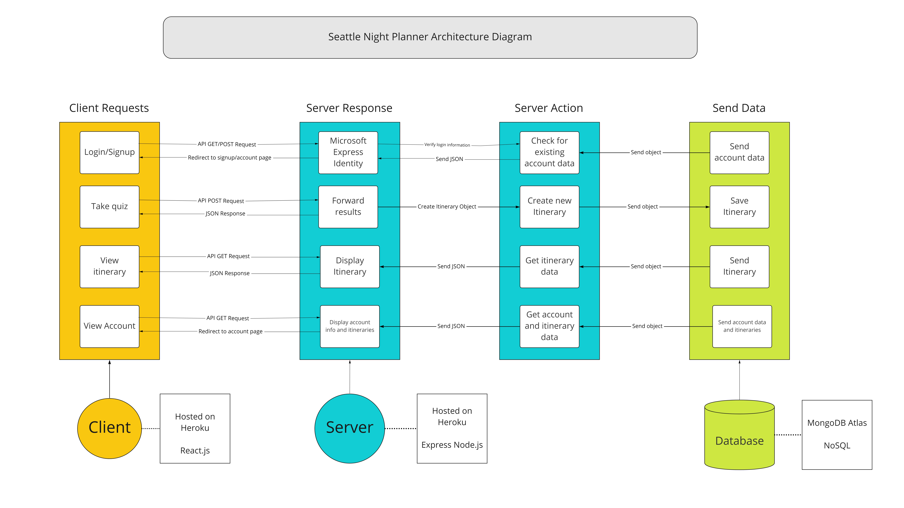

# INFO 441 Final Project - Itinerary Planner

__Authors:__ Jason Jung, [Arjun Srivastava](https://github.com/a-r-j-u-n-s), Tony Choi, Ginsu Eddy

# Website
[Heroku Deployment](https://cultured-seattle.herokuapp.com)

# Project Description

## Problem Statement

How might young adults discover new forms of entertainment so that they can have fun while supporting indie creators/vendors and transition into normalcy after the pandemic?

## Background

With the pandemic lasting nearly two years, previously popular forms of digital entertainment like online games, Zoom calls, and Netflix watch parties have grown stale. As vaccination rates increase, people eagerly seek new ways to have fun with their friends in person while still being COVID-conscious. However, vaccines led to a rapid return to in-person, large-scale activities like concerts, clubs, and sporting events, many of which can be unsafe with the emergence of new COVID strains. Additionally, as the line blurs between COVID-safe habits and pre-pandemic lifestyles, more and more people struggle to readjust and adapt to a “normal” social life. Young people especially are ready to return to living life together. Although our target audience is directed towards young adults between the age of 20-25, we envision our platform being used by multiple demographics (older & younger populations) as we scale our project.

## Purpose

As college students and developers, we had to embrace the negative social effects of COVID-19 for the past two years. Now that we are returning to “normalcy”, we wanted to provide a convenient solution to the inevitable, awkward social transition. By providing a platform that creates a curated itinerary to explore Seattle, we hope to supplement users with an avenue to smoothly socialize with friends and beat the Seattle Freeze.

# Technical Description

## Architecture and Action Diagram

## User Stories

| Priority | User                | Description                                                                                                       | Technical Implementation                                                                                                                                                                                |
|----------|---------------------|-------------------------------------------------------------------------------------------------------------------|---------------------------------------------------------------------------------------------------------------------------------------------------------------------------------------------------------|
| P0       | As a User           | I want to be able to plan new activities my friends and I could do on a Friday night.                             | Maintain a database of events that we can use to recommend activities to users                                                                                                                          |
| P0       | As a user           | I want the ability to save multiple itineraries so I can keep track of different plans                            | Allow users to generate as many itineraries as they want by keeping the quiz open                                                                                                                       |
| P0       | As a user           | I want to be able to remove itineraries from my account after I’ve used them or if I no longer want them          | Allow users to remove itineraries from their profile page by assigning them to divs with a unique ID based on the ID of the itinerary (to avoid deleting multiple itineraries at once)                  |
| P1       | As a user           | I want to easily find activities and events that align with my interests                                          | Have users take a quiz/survey with preferences and send them a customized itinerary based on their answers                                                                                              
| P1       | As a new business   | I want to be included in the new app seeing how other businesses are getting success off of it                    | We will look to get integrated into the app database by contacting the creators of the app so we could be added to the database and also be added onto people’s itiniarys.                              |

## API Endpoints

### Authentication
- GET
    - /signin
        - Logs in user and sets session fields
    - /signout
        - Logs out user and destroys session

### Users : /users/
- GET
  - ?user=
    - Gets display information for given user
  - /myprofile
    - Get display information of currently logged in user

- POST
    - /update
        - updates logged users preferred displayname/itineraries
- DELETE
    - /
        - Deletes currently logged in user and their itineraries from database

### Itineraries : /itineraries/

- GET:
    - /p?user=
        - Get itineraries for given user
    - /
        - Create itinerary based on preferences quiz
- POST:
    - /
        - Post new itinerary to database with reference to logged in user
- DELETE
    - /{id}
        - Delete itinerary from currently logged in users account with given ID

## Database Schemas

We will be hosting all of our data on MongoDB Atlas (NoSQL)

### User
Represents a single user

- ___id__: Key
- __email__: String
- __first_name__: String
- __last_name__: String
- __phone_number__: String

### Event
Events represent individual activities on an itinerary

- ___id__: String
- __name__: String
- __address__: String
- __city__: String
- __state__: String
- __zip__: String
- __neighborhood__: String
- __categories__: [String]
- __price__: Number
- __business_img_url__: String
- __phone__: String
- __hours_of_operation__: String

### Itinerary
A plan involving multiple events

- ___id__: Key
- __username__: String
- __created_date__: Date
- __Event_0__: Event
- __Event_1__: Event
- __Event_2__: Event